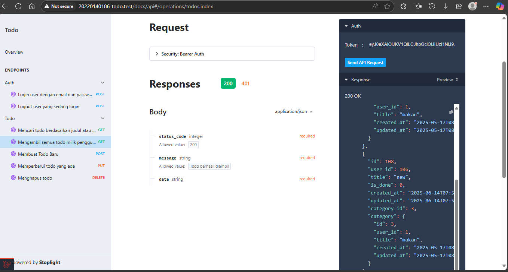

# Tugas 12

## 1. Logout

## 2. Endpoint untuk mengambil semua data Todo

## 3. Endpoint untuk menambah data Todo baru

## 4. Endpoint untuk mengubah Todo

## 5. Endpoint untuk menghapus Todo

## 6. Endpoint untuk melakukan pencarian pada Todo 

